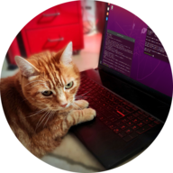

# 👋 About me

🎓 Currently studying at [Polytech Nice Sophia](https://polytech.univ-cotedazur.fr/).

💡 Mainly interested in artificial intelligence (AI). I do wish to get a job in the future in one of these topics.

💻 I mainly use GitHub to compare myself over time, to see my improvements. I also upload personal and school projects which I enjoyed working on.

🥸 By the way, I have a blog where I share what I think can be useful or interesting. You can read more [here](https://marcpinet.me/).

# 💾 Programming languages — I mean, those I like :)

<table>
  <td align="center" width="96">
    
     Python
  </td>
    <td align="center" width="96">
    
     Java
  </td>
</td>
    <td align="center" width="96">
    
     C#
  </td>
  <td align="center" width="96">
    
     C++
  </td>
  <td align="center" width="96">
    
     Rust
  </td>
  </td>
    <td align="center" width="96">
    
     C
  </td>
    </td>
    <td align="center" width="96">
    
     Kotlin
  </td>
  <td align="center" width="96">
    
     PL/SQL
  </td>
  <td align="center" width="96">
    
     Bash
  </td>
</table>

# ⚙️ Operating systems

<table>
  <td align="center" width="96">
    
     Windows
  </td>
  <td align="center" width="96">
    
     Linux
  </td>
  <td align="center" width="96">
    
     Android
  </td>
</table>

# 🔧 Tools

<table>
  <td align="center" width="96">
    
     VS Code
  </td>
  <td align="center" width="96">
    
     VS
  </td>
  <td align="center" width="96">
    
     Jetbrains
  </td>
  <td align="center" width="96">
    
     Arduino
  </td>
  <td align="center" width="96">
    
     Git
  </td>
  <td align="center" width="96">
    
     GitHub
  </td>
    <td align="center" width="96">
    
     Android Studio
  </td>
  <td align="center" width="96">
    
     Firebase
  </td>
</table>

# 📬 Contact me

<table>
  <td align="center" width="96">
    <a href="https://marcpinet.me/contact/">
     My website
  </td>
  <td align="center" width="96">
    <a href="https://www.linkedin.com/in/marc-pinet/">
     Linkedin
  </td>
  </a>
  <td align="center" width="96">
    <a href="https://www.instagram.com/marc.pnt/">
     Instagram
  </a>
  </td>
</table>

# <!-- LEAVE EMPTY  -->

