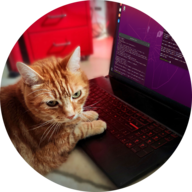

# 👋 About me

💡 Incoming PhD Researcher in Deep Learning for Anomaly Detection & Explainable AI @ Orange × Université Grenoble Alpes

💻 I mainly use GitHub to share my personal projects, alongside some school projects I enjoyed working on

🥸 By the way, I have a blog where I share interesting stuff about AI (from beginner-friendly to advanced level). You can read more [here](https://marcpinet.me/).

# 📬 Contact me

<table>
  <td align="center" width="96">
    <a href="https://marcpinet.me/contact/">
     Portfolio
  </td>
  <td align="center" width="96">
    <a href="https://www.linkedin.com/in/marc-pinet/">
     Linkedin
  </td>
  </a>
</table>

